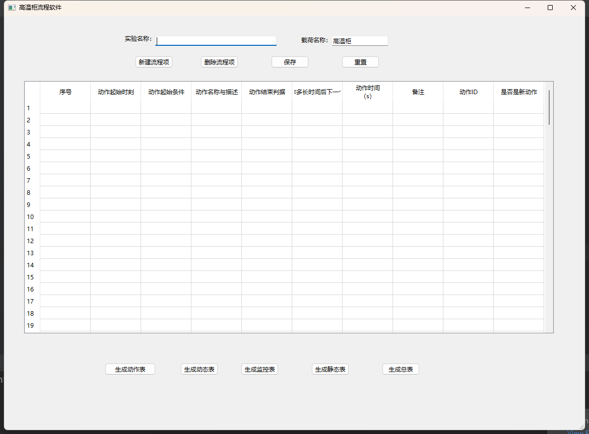
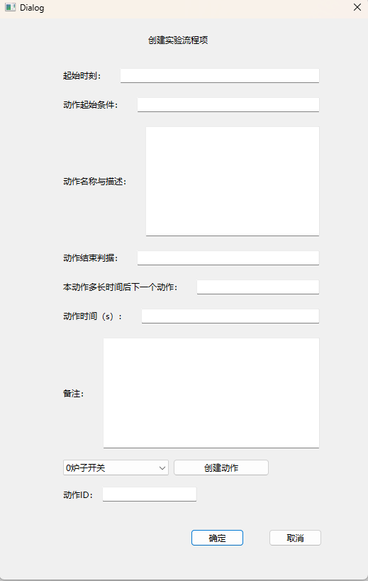

# 高温柜实验流程软件

## 介绍

目前高温柜空间科学实验所使用的软件非常难操作，需要人工配置动作ID、生成动态表、检查流程，这个过程非常耗时且易出错。因此需要开发一套新的实验流程软件，尽量减少人工参与度，简化整个实验流程表的生成工作。

软件运行最后的结果是要生成含有一堆流程表的总文件，通过地面注入实验流程序号，可以指定跑对应的流程。但是软件设计界面，尽量减少人工参与度，直接通过下拉框选取控制目标（控制目标就是大的动作类别），弹出控制目标对应的参数，设置参数（每个控制目标的控制参数种类不一样，配了参数的生成对应动作表），设置该目标动作的等待时间（表示延迟多长时间执行下一条）。软件根据控制目标的设置参数，等待时间（（表示延迟多长时间执行下一条）），串联成动态表，自动关联修改静态表，动作表等，合成最终可用的总表。

原则：还是要符合之前的设计流程，生成可执行的总表，但是界面简化，具体的动作ID分配，序号连贯性等，均交由软件处理。

流程表生成后，生成电机的行程曲线，温度的爬升曲线，便于科学方检查流程是否符合他们的科学预期。

最后生成总表。

## 项目结构

```
experimental-flow-table-generation
├─app.py	# 主程序
├─furnace_switch_dlg.py	# 0炉子开关动作的参数配置界面
├─...	# 后续添加其他类别动作的参数配置界面对话框功能的实现类
├─Readme.md
├─resources.py	
├─resources.qrc
├─utils
|   └data_utils.py	# 实现了处理文件数据的一些功能
├─ui	# 存放所有QT Designer设计的UI文件和生成的.py文件
| ├─FurnaceSwitch.py
| ├─furnaceswitch.ui
| ├─hearthwiremotor.ui
| ├─MainWindow.py
| ├─mainwindow.ui
| ├─NewFlowItem.py
| ├─newflowitem.ui
| └...	# 后续添加其他UI文件
├─data	# 存放所有动作的参数配置数据
|  ├─0炉子开关.txt
|  └...	# 后续添加其他类别动作的参数配置数据
├─config	# 存放每类动作的参数配置信息
|   ├─FurnaceSwitch.yaml	
|   └... # 后续添加其他类别动作的参数配置信息
```

## 界面设计

`mainwindow.ui`



`newflowitem.ui`



`furnaceswitch.ui`

